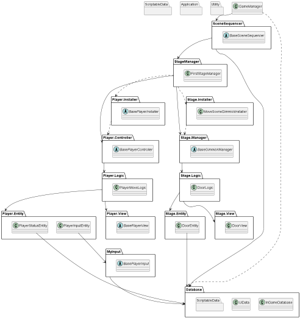

# README

## 概要
[ゲームデモ動画](https://drive.google.com/file/d/1NRwR8zzAjPiQJP4uX30hk-wa03R6-PhX/view?usp=sharing) (制作途中のため、動画ではリポジトリ内のコードの内容と合わない挙動をする場合があります。)

## 担当箇所
[Scripts/TalkSystem](https://github.com/kyoka122/SweetyPanick_Scripts/tree/main/Scripts/TalkSystem) 一部機能以外全て

## 使用ライブラリ（ライブラリは同封しておりません）
* [UniTask (ver.2.3.3)](https://github.com/Cysharp/UniTask)
* [UniRx (ver.7.1.0)](https://assetstore.unity.com/packages/tools/integration/unirx-reactive-extensions-for-unity-17276?locale=ja-JP)
* [DOTween (ver.1.2.705)](https://assetstore.unity.com/packages/tools/animation/dotween-hotween-v2-27676?locale=ja-JP)
* [AudioManager_KanKikuchi (ver.1.2)](https://github.com/kankikuchi/AudioManager)
* [JoyconLib_plugins](https://github.com/Looking-Glass/JoyconLib)
* Cinemachine (ver.2.8.9) (UnityRegistry)
* InputSystem (ver.1.3.0) (UnityRegistry)

## クラス図

[pumlファイル](https://github.com/kyoka122/SweetyPanick_Scripts/blob/main/Scripts/ClassDiagram/InGame.puml)

